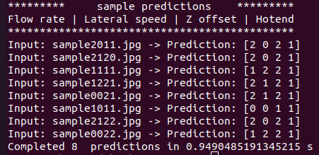

# AI-Based Defect Detector for Additive Manufacturing (AIDDAM) 
EECS 504 Project Source Code

Following are the 2 papers which are followed for developing the model and getting the dataset:
- [Residual Attention Network for Image Classification](MHResAttNet-dataset_full-04122023-epoch=14-val_loss=3.17-val_acc=0.64.ckpt)
- [Generalisable 3D printing error detection and correction via multi-head neural networks](https://www.nature.com/articles/s41467-022-31985-y)

## Download Dataset
For the ground-truth data, I utilized a refined CSV file sourced from the second paper, accessible [here](https://www.repository.cam.ac.uk/items/6d77cd6d-8569-4bf4-9d5f-311ad2a49ac8).
To train the model, ensure you have the "caxton_dataset_filtered.csv" file along with the images corresponding to the entries in the CSV. Please note that the dataset is extensive and may require approximately 50GB of storage space. It's essential to manually download each data folder to complete the dataset preparation process.

## Setup
In order to set the environment, use requirements.txt file. Current implementation is done on Ubuntu 18.04 with following versions:
- Python 3.6.9
- PyTorch 1.7.1
- Torchvision 0.8.2
- CUDA v11.3

```
virtualenv -p python3 environ
source environ/bin/activate
pip install -r requirements.txt
```

## Usage
PyTorch-Lightning (1.1.4) is used as wrapper for both the dataset and data module classes. Configuration parameters for the training are in **src/train_config.py**. 
Currently, maximum epoch are set to 15 which can be modified using (-e) and (-s) for seed parameter. Use following command to train the model:
```
python3 src/train.py
```

If you want to use pre-trained model, you can use this [link](https://drive.google.com/file/d/1IqC9cNaDSQz8aydt-Dmxj-BfH6-mCg2t/view?usp=sharing) to download the model which I trained on RTX 2080 GPU with 15 epoch. Place it in the checkpoints directory.

To run pre-trained model you can use following command:
```
python3 src/sample.py
```
The above approach will work only if the environment is set correctly. Considering the versions used for this implementation are very old, I have configured a docker with everything built inside it. I will add the docker here.
```

## Results Using Sample Data


